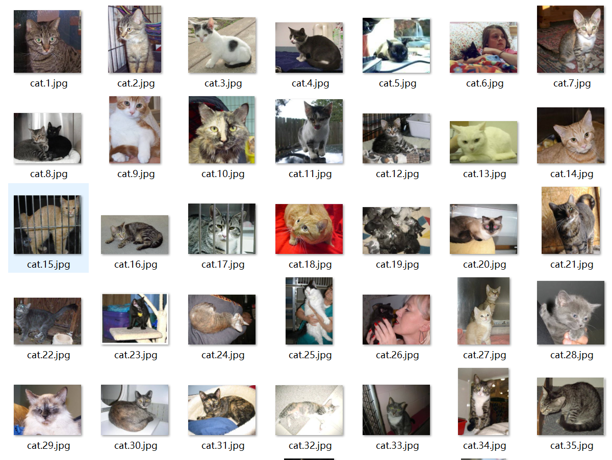
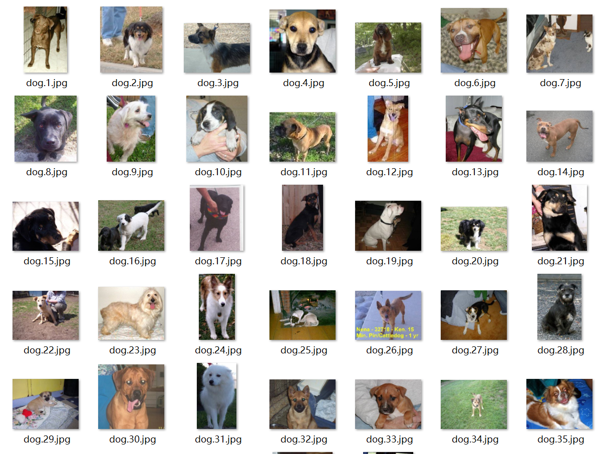
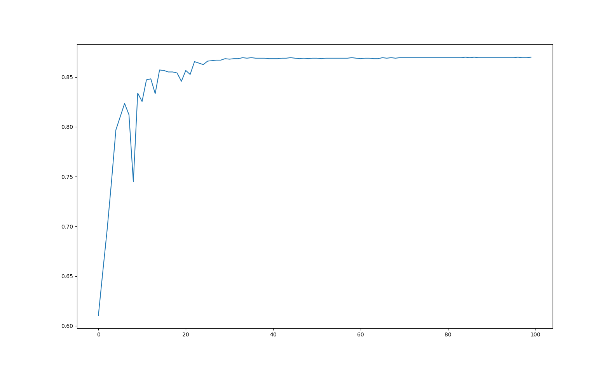
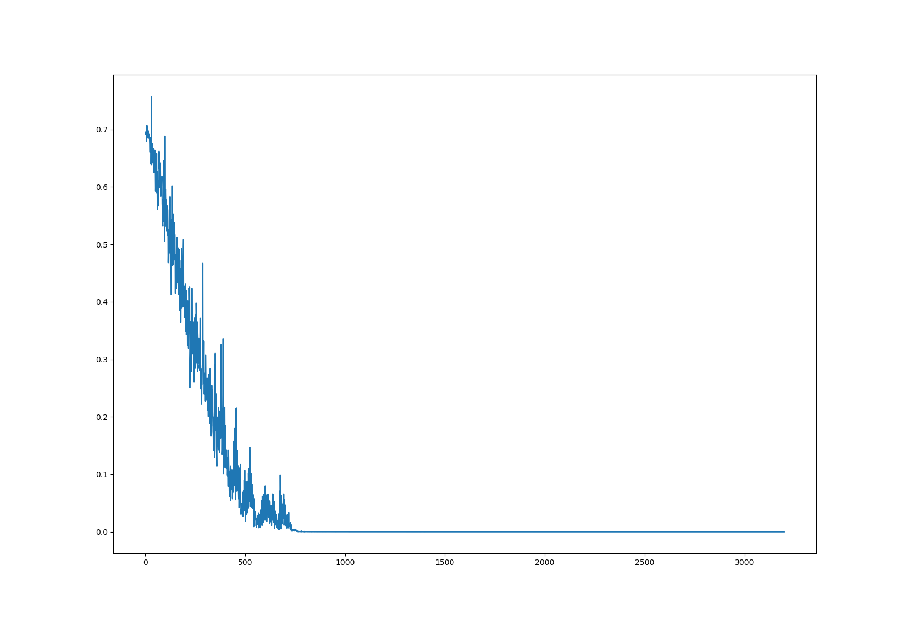

# **基于Alexnet的猫狗大战**

李俊然

18377198

## **数据来源**

数据来自于[kaggle](https://www.kaggle.com/tongpython/cat-and-dog)，网址为[https://www.kaggle.com/tongpython/cat-and-dog](https://www.kaggle.com/tongpython/cat-and-dog)。测试集包含4000张猫、4005张狗，测试集包含了1011张猫、1012张狗。部分图片如下。





可以看到数据较为复杂，图片尺寸不一且部分图片存在干扰。

## **网络结构**

网络利用python中pytorch建立，更改分类数为2，网络输出为二维tensor。


```python
class AlexNet(nn.Module):
    def __init__(self, num_classes=2):
        super(AlexNet, self).__init__()
        self.features = nn.Sequential(
            nn.Conv2d(3, 64, kernel_size=11, stride=4, padding=2),
            # 卷积核为11*11*3（RGB三个通道），步长为4，边缘补两个0，输出维度为64
            nn.ReLU(inplace=True),
            # 激活函数为ReLU
            nn.MaxPool2d(kernel_size=3, stride=2),
            # 最大值池化
            nn.Conv2d(64, 192, kernel_size=5, padding=2),
            nn.ReLU(inplace=True),
            nn.MaxPool2d(kernel_size=3, stride=2),
            nn.Conv2d(192, 384, kernel_size=3, padding=1),
            nn.ReLU(inplace=True),
            nn.Conv2d(384, 256, kernel_size=3, padding=1),
            nn.ReLU(inplace=True),
            nn.Conv2d(256, 256, kernel_size=3, padding=1),
            nn.ReLU(inplace=True),
            nn.MaxPool2d(kernel_size=3, stride=2),
        )
        self.classifier = nn.Sequential(
            nn.Linear(256 * 6 * 6, 4096),
            nn.ReLU(inplace=True),
            nn.Linear(4096, 4096),
            nn.ReLU(inplace=True),
            nn.Linear(4096, num_classes),
        )

    def forward(self, x):
        x = self.features(x)
        x = x.view(x.size(0), 256 * 6 * 6)
        x = self.classifier(x)
        return x
```

## **训练过程**

### **数据预处理**

由于图片尺寸不一致，因此先将图片较短的一边缩放到224像素，再居中裁剪形成224\*224\*3，最后进行归一化，便于训练。同时数据集已经按照文件夹分类，直接使用ImageFolder载入数据。

```python
transform = transforms.Compose([
        transforms.Resize(224),
        transforms.CenterCrop(224), 
        transforms.ToTensor(),  
        transforms.Normalize(mean=[0.485, 0.456, 0.406], std=[0.229, 0.224, 0.225])
    ])

dataset = dset.ImageFolder("./training_set", transform=transform)
testset = dset.ImageFolder("./test_set", transform=transform)
```


### **建立网络并设置参数**

batch_size设置较大，加快收敛速度，多线程读取加速I/O，学习率设置为0.0001。

```python
device = torch.device('cuda' if torch.cuda.is_available() else 'cpu')
batch_size = 256
lr= 0.0001
net = AlexNet().to(device)
trainloader = torch.utils.data.DataLoader(dataset, batch_size=batch_size, shuffle=True, num_workers=12)
# 训练集需要打乱顺序
testloader = torch.utils.data.DataLoader(testset, batch_size=batch_size, shuffle=False, num_workers=12)
criterion = nn.CrossEntropyLoss()
optimizer = torch.optim.Adam(net.parameters(), lr=lr)
```


### **开始训练**

```python
for epoch in range(100):
    running_loss = []
    t1 = time.time()
    for i, data in enumerate(trainloader, 0):
        inputs, labels = data
        inputs, labels = inputs.to(device), labels.to(device)
        optimizer.zero_grad()
        outputs = net(inputs)
        loss = criterion(outputs, labels)
        loss.backward()
        optimizer.step()
        running_loss.append(loss.item())
        loss_seq.append(loss.item())
    t2 = time.time()
    t = t2 - t1
    print('epoch:%d  loss: %.8f  time:%.2fs' % (epoch + 1, np.mean(running_loss), t))
    ac = ac_rate(testloader, net, device)
    ac_seq.append(ac)
```


## **训练结果**

下面是训练过程中部分输出（删去了中间部分）

```
start training
epoch:1  loss: 0.68571441  time:25.09s
1235/2023
epoch:2  loss: 0.63176933  time:21.85s
1323/2023
epoch:3  loss: 0.59342728  time:21.56s
1409/2023
………………#删去了中间部分
epoch:98  loss: 0.00000084  time:20.27s
1759/2023
epoch:99  loss: 0.00000080  time:20.43s
1759/2023
epoch:100  loss: 0.00000075  time:20.44s
1760/2023
Finished Training
total time:3528.7s
```

测试集准确率（每epoch求一次）如下图，随着训练轮次逐步上升，中间出现了一些震荡，最后慢慢收敛到87%左右



loss（每batch求平均）如下图，随着训练轮次逐渐下降至接近0



## 完整代码

```python
import matplotlib.pyplot as plt
import torch
from torch import nn
import torchvision.datasets as dset
from torchvision import transforms
import numpy as np
import time


class AlexNet(nn.Module):
    def __init__(self, num_classes=2):
        super(AlexNet, self).__init__()
        self.features = nn.Sequential(
            nn.Conv2d(3, 64, kernel_size=11, stride=4, padding=2),
            nn.ReLU(inplace=True),
            nn.MaxPool2d(kernel_size=3, stride=2),
            nn.Conv2d(64, 192, kernel_size=5, padding=2),
            nn.ReLU(inplace=True),
            nn.MaxPool2d(kernel_size=3, stride=2),
            nn.Conv2d(192, 384, kernel_size=3, padding=1),
            nn.ReLU(inplace=True),
            nn.Conv2d(384, 256, kernel_size=3, padding=1),
            nn.ReLU(inplace=True),
            nn.Conv2d(256, 256, kernel_size=3, padding=1),
            nn.ReLU(inplace=True),
            nn.MaxPool2d(kernel_size=3, stride=2),
        )
        self.classifier = nn.Sequential(
            nn.Linear(256 * 6 * 6, 4096),
            nn.ReLU(inplace=True),
            nn.Linear(4096, 4096),
            nn.ReLU(inplace=True),
            nn.Linear(4096, num_classes),
        )

    def forward(self, x):
        x = self.features(x)
        x = x.view(x.size(0), 256 * 6 * 6)
        x = self.classifier(x)
        return x


def ac_rate(test_dataloader, net, device):
    total = 0
    ac = 0
    for i, data in enumerate(test_dataloader, 0):
        inputs, labels = data
        inputs, labels = inputs.to(device), labels.to(device)
        outputs = net(inputs)
        outputs = outputs.argmax(dim=1)
        ac += int((outputs == labels).sum())
        total += len(inputs)
    print(ac, "/", total, sep='')
    return ac / total


def main():
    transform = transforms.Compose([
        transforms.Resize(224),  # 缩放图片，保持长宽比不变，最短边的长为224像素,
        transforms.CenterCrop(224),  # 从中间切出 224*224的图片
        transforms.ToTensor(),  # 将图片转换为Tensor
        transforms.Normalize(mean=[0.485, 0.456, 0.406], std=[0.229, 0.224, 0.225]) 
    ])

    dataset = dset.ImageFolder("./training_set", transform=transform)
    testset = dset.ImageFolder("./test_set", transform=transform)

    device = torch.device('cuda' if torch.cuda.is_available() else 'cpu')
    batch_size = 256
    lr = 0.0001
    net = AlexNet().to(device)
    trainloader = torch.utils.data.DataLoader(dataset, batch_size=batch_size, shuffle=True, num_workers=12)
    testloader = torch.utils.data.DataLoader(testset, batch_size=batch_size, shuffle=False, num_workers=12)
    criterion = nn.CrossEntropyLoss()
    optimizer = torch.optim.Adam(net.parameters(), lr=lr)

    print("start training")
    t0 = time.time()
    for epoch in range(100):
        running_loss = []
        t1 = time.time()
        for i, data in enumerate(trainloader, 0):
            inputs, labels = data
            inputs, labels = inputs.to(device), labels.to(device)
            optimizer.zero_grad()
            outputs = net(inputs)
            loss = criterion(outputs, labels)
            loss.backward()
            optimizer.step()
            running_loss.append(loss.item())
            loss_seq.append(loss.item())
        t2 = time.time()
        t = t2 - t1
        print('epoch:%d  loss: %.8f  time:%.2fs' % (epoch + 1, np.mean(running_loss), t))
        ac = ac_rate(testloader, net, device)
        ac_seq.append(ac)
    print('Finished Training')
    t = time.time() - t0
    print("total time:%.1fs" % (t))


loss_seq = []
ac_seq = []
if __name__ == '__main__':
    main()
```

